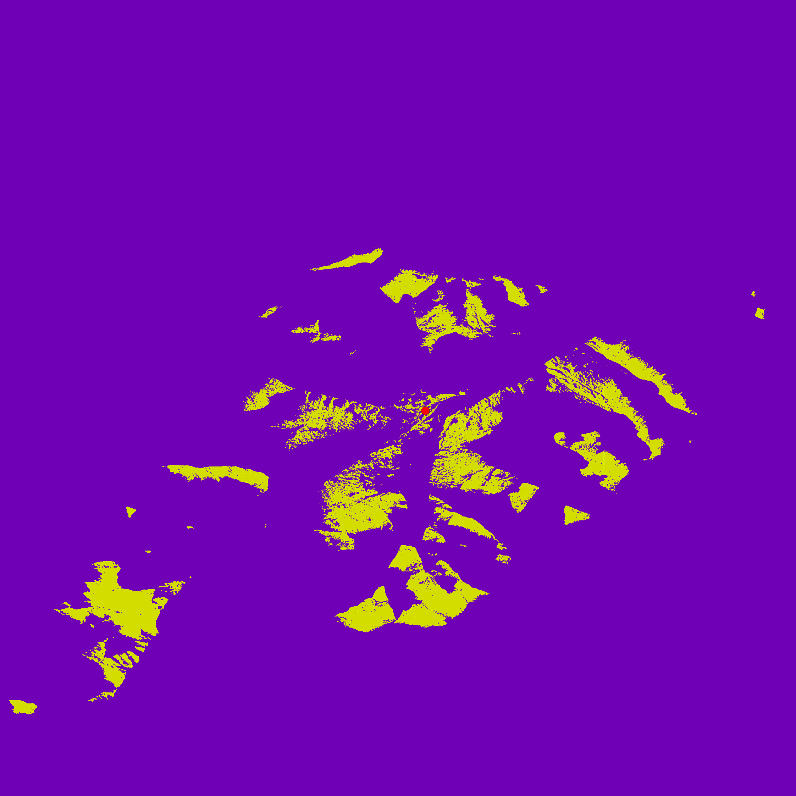
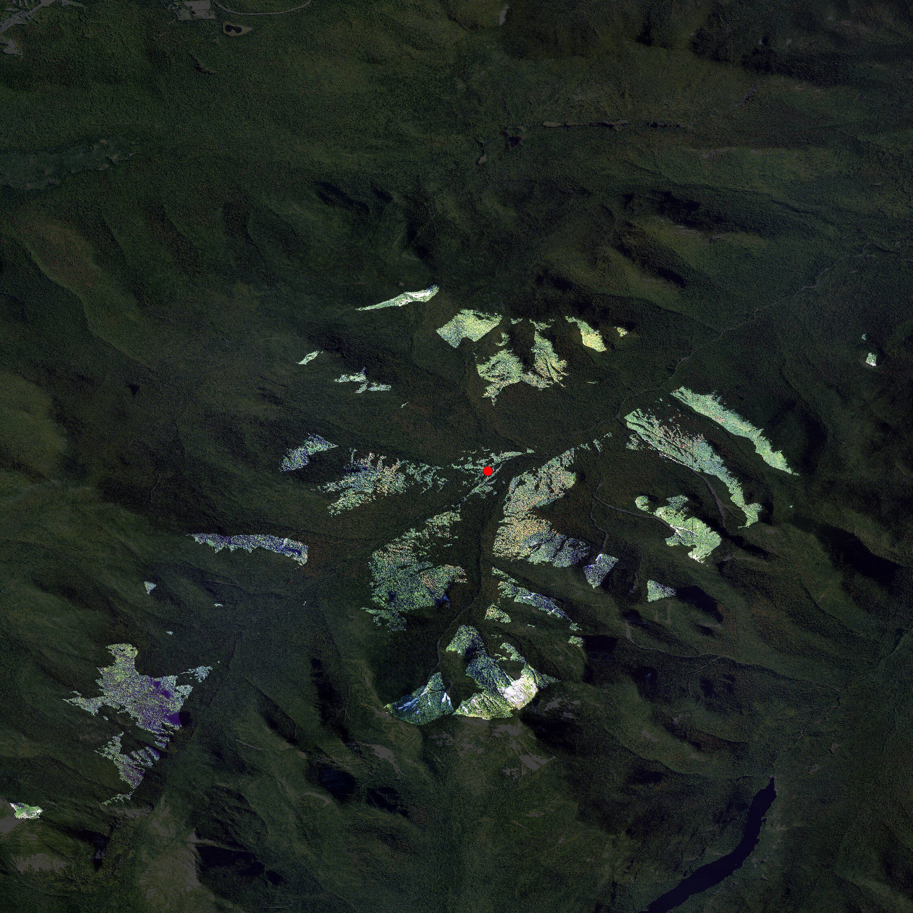
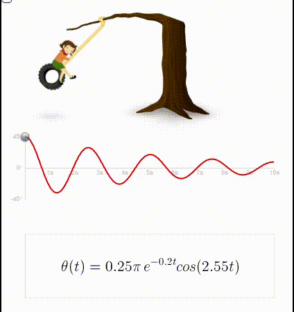
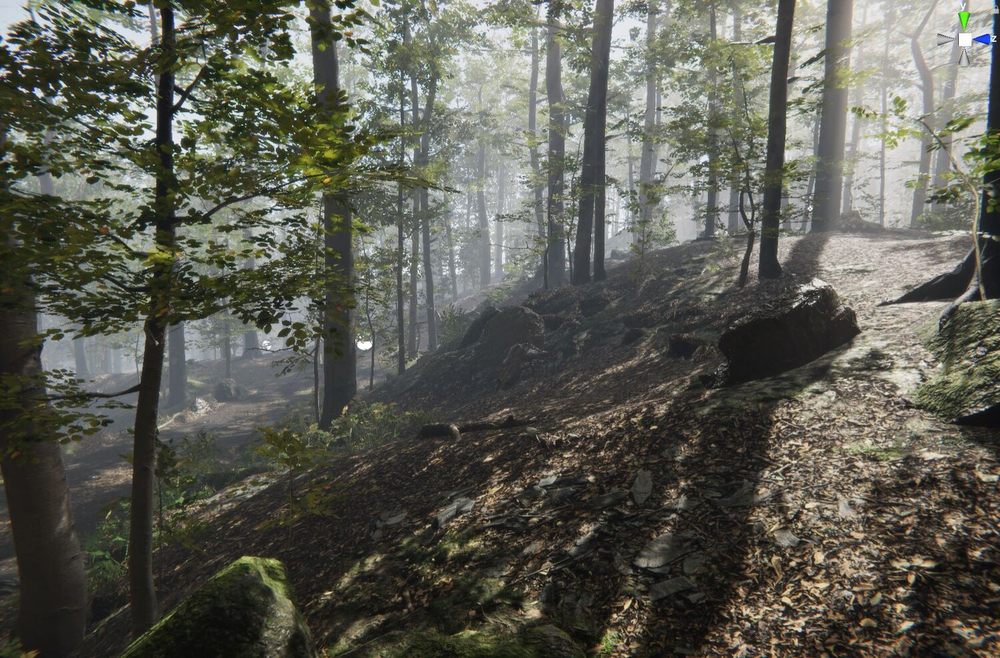

```{r setup, include=FALSE}
options(htmltools.dir.version = FALSE)
knitr::opts_chunk$set(
  fig.width=9, fig.height=3.5, fig.retina=3,
  out.width = "100%",
  cache = FALSE,
  echo = TRUE,
  message = FALSE, 
  warning = FALSE,
  fig.show = TRUE,
  hiline = TRUE
)
library(ggplot2)
library(terrainr)
library(sf)
theme_set(theme(axis.text = element_blank()))
xaringanExtra::use_webcam()
```

```{r xaringan-themer, include=FALSE, warning=FALSE}
library(xaringanthemer)

style_duo_accent(
  primary_color = "#26375b",
  secondary_color = "#27686d",
  inverse_header_color = "#FFFFFF"
)
```

# Outline

### 1. Visualizing in game engines

### 2. Visualizing with code

### 3. Visualizing the future

---

# About Me

.pull-left[

- Mike Mahoney

- Ph.D. Student at SUNY-ESF

- Environmental visualization as a way to think about large-scale systems

- https://mm218.dev

]

.pull-right[

```{r, echo=FALSE}
knitr::include_graphics("https://github.com/mikemahoney218.png")
```

]

<div></div>

Slides available at https://mm218.dev/vrs2021  
Paper available at https://www.mm218.dev/papers/vrs_2021.pdf

---


(Photo CC BY-NC-ND 2.0 by user "page" on flickr.)

---
class: center middle

```{r, echo = FALSE, out.width='75%'}

```

---
class: center middle

```{r, echo = FALSE, out.width='75%'}

```

---
class: center middle



(Animation from Bret Victor: http://worrydream.com/LadderOfAbstraction/)

---

# What's terrainr?

.pull-left[

- New R package with two focuses:

  1. Data access and retrieval
  
  2. Spatial data visualization

<br />  

- https://github.com/ropensci/terrainr

]

.pull-right[

```{r, echo=FALSE}
knitr::include_graphics("https://github.com/ropensci/terrainr/raw/main/man/figures/logo.png")
```

]

---

```{r, eval = FALSE}
library(sf)
library(terrainr)
coords <- data.frame(y = 44.1585, x = -73.8624)
lodge_coords <- st_as_sf(coords,  coords = c("x", "y"))
lodge_coords <- st_set_crs(lodge_coords, 4326)
lodge_bbox <- set_bbox_side_length(lodge_coords, 12200)
lodge_tiles <- get_tiles(lodge_bbox, "johns_brook",
                         services = c("elevation", "ortho"))
mapply(merge_rasters, lodge_tiles, c("dem.tif", "ortho.tif"))
```

--

```{r, eval = FALSE}
vector_to_overlay(lodge_coords, "dem.tif",
                  color = "red",
                  size = 10,
                  output_file = "point_location.tiff")
raster_to_raw_tiles("dem.tif", "heightmap")
raster_to_raw_tiles("ortho.tif", "ortho", raw = FALSE)
raster_to_raw_tiles("point_location.tiff", "point", raw = FALSE)
```


---

```{r, eval = FALSE}
library(rgrass7)
initGRASS(system("grass --config path", intern = TRUE),
          raster::tmpDir(),
          mapset = "PERMANENT",
          override = TRUE)
execGRASS("g.proj", "c", georef = "dem.tif")
execGRASS("r.in.gdal",
          c("overwrite", "o"),
          input="dem.tif",
          band=1,
          output="elevation")
execGRASS("g.region",
          raster="elevation")
execGRASS("r.viewshed",
          c("b", "overwrite"),
          input="elevation",
          coordinates=c(coords$x, coords$y),
          memory=1000,
          output="viewshed")
execGRASS("r.out.gdal",
          c("t", "m", "overwrite"),
          input="viewshed",
          output="viewshed.tif",
          format="GTiff",
          createopt="TFW=YES,COMPRESS=LZW")
```

---

```{r, eval = FALSE}
library(raster)
viewshed <- raster("viewshed.tif")
alpha <- viewshed == 0
viewshed <- brick(viewshed, viewshed, viewshed, alpha)
writeRaster(viewshed, "viewshed.tif", overwrite = TRUE)
raster_to_raw_tiles("viewshed.tif", "viewshed", raw = FALSE)
```

---
class: center middle



---


# Thank you!

This work was financially supported by the State University of New York via the ESF Pathways to Net Zero Carbon initiative.

#### More terrainr:

`r icons::fontawesome("github")` [ropensci/terrainr](https://github.com/ropensci/terrainr)

`r icons::fontawesome("book")` [https://docs.ropensci.org/terrainr/](https://docs.ropensci.org/terrainr/)

#### Find me online:

`r icons::fontawesome("github")` [@mikemahoney218](https://github.com/mikemahoney218/)

`r icons::fontawesome("twitter")` [@mikemahoney218](https://twitter.com/mikemahoney218/)

`r icons::fontawesome("globe")` [mm218.dev](https://mm218.dev)

<div></div>

Slides available at https://mm218.dev/vrs2021  
Paper available at https://www.mm218.dev/papers/vrs_2021.pdf

